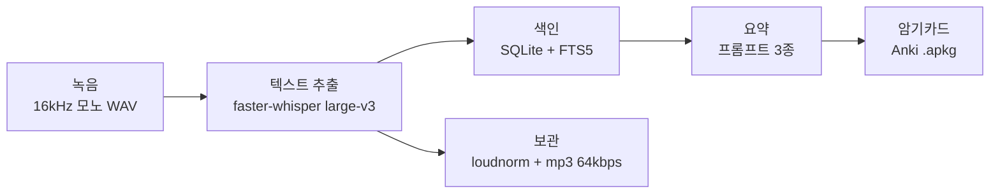

# Learn_TEXT

강의 영상의 소리를 녹음해 텍스트로 옮기고, 요약과 Anki 암기카드까지 만들어 주는 Windows 데스크톱 앱

**최신 버전 v15.9.4** (2026-09-30) · Windows 11 x64 · 음성인식은 PC 안에서 CPU로 처리 (GPU 불필요)

[주요 기능](#주요-기능) · [설치](#설치) · [처리 흐름](#처리-흐름) · [음성인식 설정](#음성인식-설정) · [기술 구성](#기술-구성) · [릴리스 노트](#릴리스-노트)

---

## 주요 기능

**녹음 (음성 추출)**
- 앱 안의 브라우저에서 강의 영상을 재생하면서 PC에서 나오는 소리를 그대로 녹음합니다. 가상 오디오 드라이버나 별도 장치가 필요 없습니다.
- 처음부터 음성인식용 형식(16kHz 모노)으로 녹음해 데이터량을 44.1kHz 스테레오의 약 1/5.5로 줄입니다.
- 일시정지·재개, 즉시 정지·순차 정지, 여러 강의를 대기열에 넣고 차례로 녹음
- 녹음 중에는 영상이 음소거되거나 음량이 0이면 자동으로 되돌리고 알려 줍니다.
- 녹음 중에는 화면 꺼짐과 절전을 막아 녹음이 멈추지 않게 합니다.

**텍스트 추출 (음성인식)**
- faster-whisper로 한국어 음성을 텍스트(.txt)와 자막(.srt)으로 변환합니다.
- 녹음이 끝나면 자동으로 변환 대기열에 들어가고, 한 번에 한 건씩 처리합니다.
- 변환 중에 앱을 꺼도, 다음 실행 때 끝나지 않은 작업을 찾아 대기열에 다시 넣습니다.
- 반복 구절이 많이 섞인 예전 결과는 보관 중인 음성 파일로 다시 추출할 수 있습니다.
- 변환이 끝나면 음량을 맞춘(loudnorm) 뒤 mp3(64kbps)로 압축하고 원본 wav는 지웁니다. 90분 강의 기준 약 173MB → 43MB

**강의 관리**
- 학기·과목·강의 단위의 목록, 강의별 녹음·텍스트·요약·암기카드 상태를 아이콘으로 표시
- 제목·과목·본문·요약 전체에서 검색 (SQLite FTS5)
- 파일 잠금, 이름 변경, 색인 재구축, 강의 교안(PDF·PPT·HWP 등) 첨부
- 저장 공간 현황과 CPU·메모리 사용률 표시
- 사용자(UID)별로 강의 목록과 파일을 따로 저장

**요약**
- 시험대비·개념정리·요약불릿 3종 요약, 코딩 과목은 코딩 요약 추가
- 모든 요약 프롬프트에 "강의 텍스트에 있는 내용만 사용"하도록 제약을 넣어, 강의에서 다루지 않은 내용이 섞이지 않게 합니다.
- 긴 강의는 45,000자 단위로 줄을 기준으로 나눠 요약합니다.
- 기본 방식은 Claude 반자동 요약입니다: 프롬프트를 복사하면 Claude 앱(또는 웹)이 열리고, 결과를 붙여넣으면 저장됩니다.
- 요약 템플릿은 설정에서 직접 고치거나 기본값으로 되돌릴 수 있습니다.
- Claude API, 로컬 LLM(Ollama)은 엔진을 바꿔 끼우는 구조만 준비된 실험 기능입니다.

**암기카드 (Anki)**
- 요약 결과로 Anki 덱 파일(.apkg)을 바로 만듭니다. genanki의 .apkg 생성 구조를 Node로 옮겨 구현했습니다.
- 과목별 덱 방식: 5지선다 / 코딩 문제(핵심 로직 빈칸 채우기·결과 예측) / 둘을 섞은 덱 / 두 파일로 따로
- 덱 미리보기, 문제 번호로 찾아 수정, 수정 전 백업 복원, 새 카드 순서 섞기

**화면**
- 3단 화면, 다크 모드, Pretendard 글꼴
- 미니 모드(작은 창)와 항상 위 표시
- 통합 로그 보기

---

## 설치

1. `Learn_TEXT-Setup-15.9.4.exe`를 실행하고 설치 위치를 고릅니다. (약 137MB, ffmpeg 포함)
2. 처음 실행하면 데이터 폴더를 고릅니다. 녹음·텍스트·요약·색인 DB·로그가 모두 이 폴더에 저장됩니다.
3. 설정의 **자동 설치 마법사**가 필요한 프로그램을 확인하고, 없는 항목만 설치합니다.

| 순서 | 항목 | 방법 |
|---|---|---|
| 1 | Python 3.11 | 없으면 winget으로 설치 |
| 2 | ffmpeg | 설치 파일에 포함 |
| 3 | GPU 검사 | NVIDIA GPU가 없으면 CPU(int8) 모드로 확정 |
| 4 | Python 가상환경 | 앱 전용 venv 생성 |
| 5 | faster-whisper | CPU 전용 PyTorch와 함께 설치 |
| 6 | Whisper 모델 | large-v3 다운로드 (약 3GB) |
| 7 | 테스트 녹음 | 5초 동안 재생 중인 소리를 녹음해 동작 확인 |

**권장 환경**
- Windows 11 x64
- 첫 설치 때 인터넷 연결 (패키지·모델 다운로드). 이후 음성인식은 오프라인으로 동작합니다.
- 처리 시간: large-v3 모델, CPU 기준으로 90분 강의 한 편에 60~90분 정도 걸립니다. 더 빠른 처리가 필요하면 설정에서 large-v3-turbo나 medium으로 바꿀 수 있습니다.

---

## 처리 흐름



| 단계 | 처리 내용 |
|---|---|
| 녹음 | Electron desktopCapturer로 시스템 소리 캡처 → 청크마다 바로 16비트 정수로 변환해 메모리 사용량을 절반으로 유지 (2시간 녹음 약 460MB → 230MB) |
| 텍스트 추출 | 변환 대기열에 자동 등록 → 앱 전용 Python 프로세스에서 faster-whisper 실행 → `.txt` · `.srt` 생성 |
| 색인 | 강의 정보·파일 경로·텍스트 해시를 SQLite(WAL)에 기록하고 전문 검색 색인 갱신 |
| 요약 | 템플릿에 학기·과목·강의명·본문을 넣어 프롬프트 생성, 길면 45,000자 단위로 분할 |
| 암기카드 | 요약 결과를 문제·보기·정답·해설로 나눠 .apkg 파일 생성 |

---

## 음성인식 설정

| 옵션 | 값 | 이유 |
|---|---|---|
| 모델 | `large-v3` (기본), `large-v3-turbo`, `medium` | 텍스트가 요약·암기카드의 원료라 정확도를 우선 |
| `device` / `compute_type` | `cpu` / `int8` | GPU 없는 노트북에서 메모리·연산량 감소 |
| `cpu_threads` | 전체 코어 수 − 2 | 변환 중에도 녹음·화면 처리용 코어 확보 |
| `language` | `ko` | 한국어 고정 |
| `beam_size` / `best_of` | 5 / 5 | 품질 우선 |
| `temperature` | 0.0 → 0.2 → 0.4 | 실패한 구간만 재시도 |
| `vad_filter` | 사용 | 무음 구간을 변환 대상에서 제외 |
| `condition_on_previous_text` | 사용 안 함 | 무음 구간에서 같은 문장을 반복 생성하는 현상 방지 |
| `initial_prompt` | 과목명 + 강의명 | 전문용어 인식률 향상 |

변환 결과에서 1~6단어짜리 구절이 3번 이상 연달아 나오면 한 번으로 줄이고, 바로 앞과 똑같은 문장은 뺍니다.

---

## 기술 구성

| 분류 | 기술 |
|---|---|
| 실행 환경 | Electron 32 |
| 화면 | React 18, TypeScript, Tailwind CSS 3, react-markdown |
| 상태 관리 | Zustand |
| 데이터 | better-sqlite3 (WAL, FTS5) |
| 음성인식 | Python 3.11, faster-whisper (CTranslate2), PyTorch CPU |
| 오디오 처리 | Web Audio API, ffmpeg |
| 암기카드 | .apkg 직접 생성 (SQLite + adm-zip) |
| 배포 | electron-builder (NSIS 설치 파일) |

```
electron/
├── main/
│   ├── index.ts          # 창·IPC·녹음 제어
│   ├── stt.ts            # faster-whisper 변환, mp3 압축
│   ├── setup.ts          # 자동 설치 마법사
│   ├── db.ts             # SQLite 색인 · FTS5 검색
│   ├── summary.ts        # 요약 템플릿
│   ├── ankiPackage.ts    # .apkg 생성
│   ├── lectureMaterial.ts / uid.ts / logging.ts
└── preload/
    ├── index.ts          # 화면 ↔ 메인 IPC 브리지
    └── browserview.ts    # 강의 영상 재생 상태 감지
src/
├── components/           # 화면 구성 요소
├── store/                # Zustand 스토어 (녹음·변환·요약·강의)
├── summarizer/           # 요약 엔진 (Claude 반자동 / API / Ollama)
└── lib/                  # 오디오 캡처, WAV 인코딩, 강의 목록 파싱
```

> 소스 코드는 비공개로 관리합니다.

---

## 사용 시 유의사항

- 이 앱으로 만든 녹음·텍스트·요약은 개인 학습(복습) 목적의 사적 복제(저작권법 제30조) 범위에서만 사용해야 합니다.
- 만든 파일을 배포하거나 다른 사람과 공유하지 마세요.
- 강의를 제공하는 기관의 이용약관을 지켜야 합니다.

---

## 릴리스 노트

### 주요 수정 사항 (v15.9.4까지 반영)

초기 버전은 설치 파일만 빌드해 배포했기 때문에 버전별 변경 기록이 없습니다. 대신 지금 버전까지 반영된 주요 수정 사항을 모았습니다.

**텍스트 추출**
- 무음 구간에서 같은 문장이 수십 번 반복 생성되고 CPU 100%로 수십 분씩 멈춘 것처럼 보이던 문제 → 앞 문장 참조를 끄고 반복 구절 축약 추가
- 과목·강의명(한글)이 들어간 경로의 파일을 음성 처리 라이브러리가 열지 못하던 문제 → 한글 없는 임시 파일로 복사해 처리
- mp3 변환에서도 같은 한글 경로 문제가 생기던 문제 → 임시 경로로 입출력 후 최종 위치로 복사
- 변환 프로세스가 메모리 부족 등으로 죽으면 원인이 전혀 남지 않던 문제 → 종료 코드와 신호를 오류 로그에 기록
- 사용자가 멈춘 변환이 성공처럼 표시되던 문제 → 사용자 중단과 실패를 구분해 처리

**녹음**
- 장시간 녹음 뒤 저장 단계에서 화면이 "저장 중..."에 멈추던 문제 → 오디오 장치 종료를 8초까지만 기다리고 계속 진행
- 노트북 화면이 꺼지면 최신 대기 모드로 들어가 녹음이 멈추던 문제 → 녹음 중에는 화면 꺼짐 자체를 막도록 변경 (절전 방지만으로는 부족했음)
- 예전에 보던 위치부터 영상이 재생되어 앞부분이 빠진 채 녹음되던 문제 → 새로 녹음할 때는 처음부터 재생하고 "이어 보기" 확인 창은 자동으로 취소
- 갓 시작한 녹음은 이름을 바꿀 수 없던 문제 → 같은 파일을 두 번 옮기려던 중복 처리 제거

**강의 관리·저장**
- 강의 삭제가 실패하던 문제 → 예전 방식(contentless)의 검색 색인 테이블이 삭제를 지원하지 않아, 일반 FTS5 테이블로 다시 만들도록 변경
- 색인을 다시 만들면 완료 표시가 사라지던 문제 → 실제 파일에서 녹음 길이를 다시 측정
- 같은 설정 파일에 쓰기가 겹치면 방금 기록한 내용이 사라지던 문제 → 임시 파일에 쓴 뒤 이름을 바꾸는 방식과 파일별 쓰기 대기열로 변경
- 오디오만 지우면 남은 텍스트 때문에 다시 녹음할 때 "_(1)" 파일이 생기던 문제 → 오디오를 지울 때 텍스트도 함께 삭제
- 앱을 꺼도 ffmpeg·설치 스크립트가 백그라운드에 남던 문제 → 실행한 하위 프로세스를 추적해 종료

**요약·암기카드**
- 긴 강의도 요약이 한 덩어리로만 나가 여러 번 나눠 붙여넣어야 하던 문제 → 빈 줄이 없으면 줄 단위로 나누고, 분할 기준을 15,000자에서 45,000자로 상향 (40,000자 강의 기준 붙여넣기 4회 → 1회)
- 5지선다에서 정답 보기만 유난히 길어 내용을 몰라도 맞힐 수 있던 문제 → 보기 길이 규칙을 프롬프트에 추가
- 같은 강의의 5지선다 카드와 코딩 카드가 같은 ID를 가져 Anki로 가져올 때 내용이 건너뛰어지던 문제 → 카드 종류별로 ID 구분
- Microsoft Store 방식으로 설치된 Claude 앱을 찾지 못하던 문제 → 설치 경로 대신 `claude://` 프로토콜 등록 여부로 확인

### 배포 이력

| 버전 | 기간 | 배포 횟수 |
|---|---|---|
| v15 | 2026-09-21 ~ 09-30 | 9회 (최신 v15.9.4) |
| v14 | 2026-09-21 | 3회 |
| v13 | 2026-09-20 ~ 09-21 | 9회 |
| v12 | 2026-09-15 ~ 09-17 | 10회 |
| v11 | 2026-09-15 | 3회 |
| v10 | 2026-09-14 ~ 09-15 | 7회 |
| **합계** | **2026-09-14 ~ 09-30** | **41회** |

<details>
<summary>빌드별 배포 일시 보기</summary>

| 버전 | 배포 일시 (KST) |
|---|---|
| v15.9.4 | 2026-09-30 13:19 |
| v15.8.3 | 2026-09-30 05:17 |
| v15.8.2 | 2026-09-30 04:47 |
| v15.7.4 | 2026-09-29 21:36 |
| v15.6.3 | 2026-09-28 01:26 |
| v15.5.2 | 2026-09-21 23:36 |
| v15.4.2 | 2026-09-21 23:19 |
| v15.3.2 | 2026-09-21 22:58 |
| v15.2.2 | 2026-09-21 22:26 |
| v14.4.2 | 2026-09-21 22:07 |
| v14.3.2 | 2026-09-21 21:21 |
| v14.2.2 | 2026-09-21 14:02 |
| v13.8.2 | 2026-09-21 13:19 |
| v13.7.2 | 2026-09-21 13:01 |
| v13.6.2 | 2026-09-21 12:42 |
| v13.5.4 | 2026-09-20 23:16 |
| v13.5.3 | 2026-09-20 23:06 |
| v13.5.2 | 2026-09-20 22:04 |
| v13.4.2 | 2026-09-20 17:00 |
| v13.3.2 | 2026-09-20 16:18 |
| v13.2.2 | 2026-09-20 16:06 |
| v12.11.2 | 2026-09-17 10:32 |
| v12.10.2 | 2026-09-17 01:35 |
| v12.9.4 | 2026-09-16 20:38 |
| v12.8.4 | 2026-09-16 20:06 |
| v12.67.4 | 2026-09-16 19:45 |
| v12.6.4 | 2026-09-16 19:37 |
| v12.5.4 | 2026-09-16 17:00 |
| v12.4.3 | 2026-09-16 16:54 |
| v12.3.3 | 2026-09-16 15:26 |
| v12.2.2 | 2026-09-15 14:50 |
| v11.3.3 | 2026-09-15 13:57 |
| v11.3.2 | 2026-09-15 12:50 |
| v11.2.2 | 2026-09-15 01:27 |
| v10.7.7 | 2026-09-15 01:08 |
| v10.6.7 | 2026-09-15 01:01 |
| v10.6.6 | 2026-09-14 21:27 |
| v10.5.6 | 2026-09-14 18:20 |
| v10.4.4 | 2026-09-14 17:42 |
| v10.3.2 | 2026-09-14 17:35 |
| v10.2.2 | 2026-09-14 17:09 |

</details>
